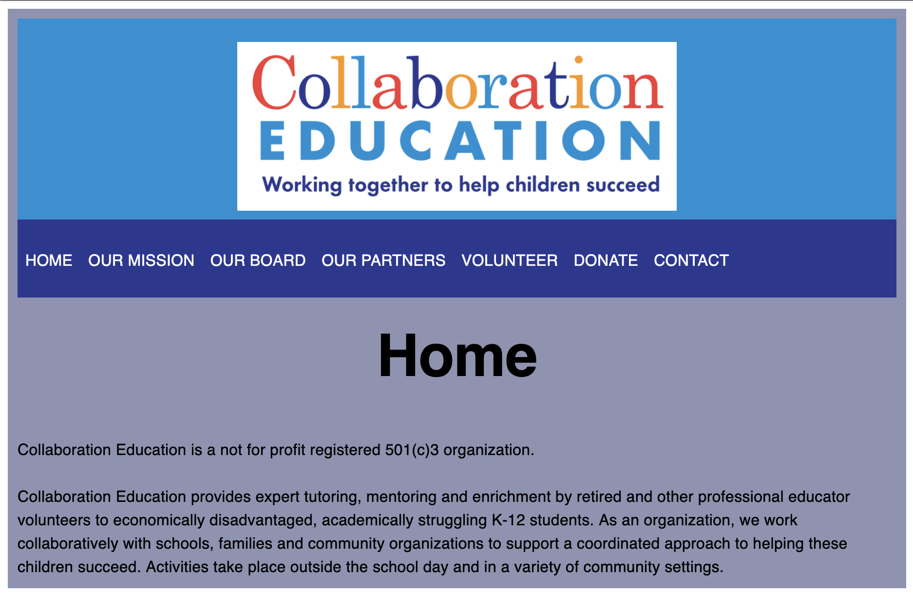

<h1 align="center">
  Collaboration Education
</h1>

## Project Info
Informational website for educational profit Collaboration Education.

## Design
The frontend was designed to customer specification using TypeScript, ReactJS, and GatsbyJS, and GraphQL is used to interface with a backend framework designed in Contentful in order to provide a simple experience for the client to change webpage content.

## Webpage
Click the image to visit the live webpage!

<a href="https://collaborationeducation.org/">
  </img>
</a>
